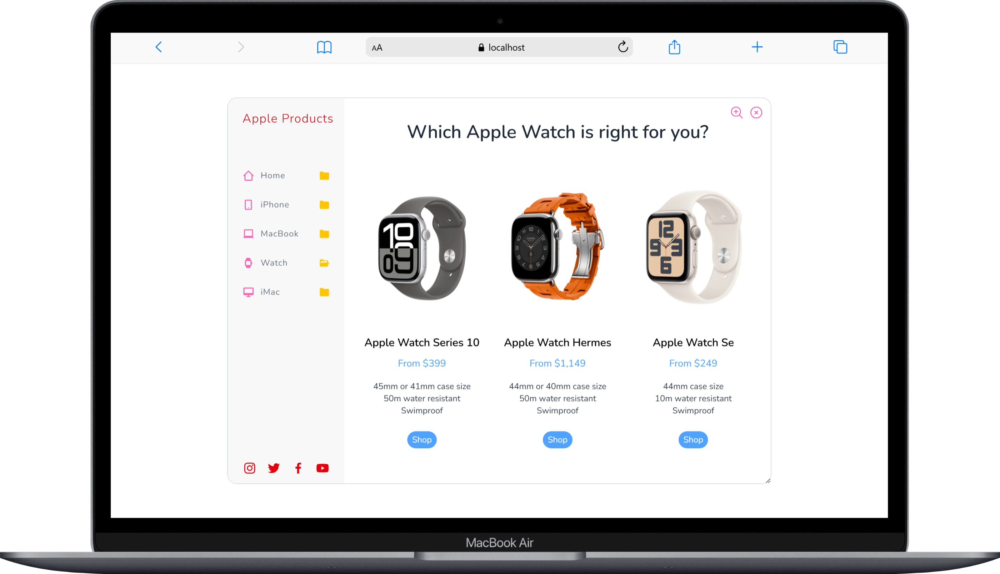
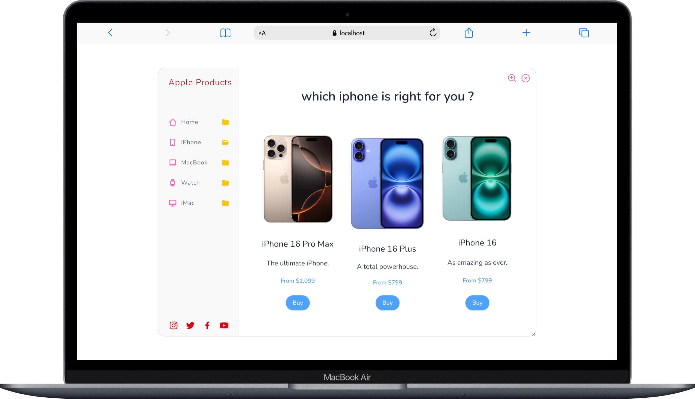
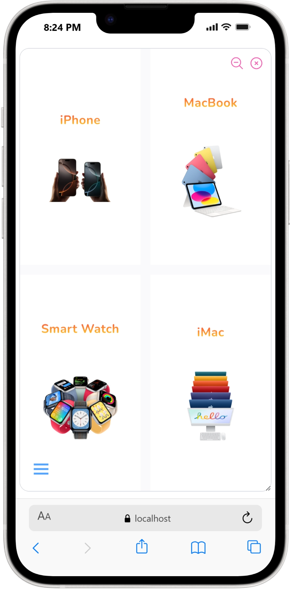

# Apple Products Store

## Short Description
A **modern Apple Products Store UI** built with React and Tailwind CSS that simulates the Apple online store experience. The project focuses on smooth page transitions, interactive product selection, and a clean Apple-inspired design.

---

## Project Overview
The **Apple Products Store** is a front-end focused e-commerce-style project designed to display Apple products in an organized and attractive way. It demonstrates best practices in UI structure, component-based development, and data handling.

The goal of the project is to simulate a real online store experience while keeping the code clean, readable, and maintainable.

---

## Features
- Multi-page store experience (Home, iPhone, MacBook, Watch, iMac)
- Custom navigation system (without React Router)
- Smooth animated page transitions
- Interactive product selection (colors, chips, models)
- Hover image transitions (Apple Watch)
- Responsive layout for desktop and mobile
- Zoomable app frame (simulate real device view)
- Reusable and clean React components

---

## Tech Stack
- **React.js** (Functional Components & Hooks)
- **Tailwind CSS** for styling and responsiveness
- **JavaScript (ES6+)**
- **Component-based architecture**
- **Local static data structure** (ready for API integration)

---

## How It Works
- The app uses a single main container that simulates an Apple-like device frame.
- Navigation is controlled using a shared `activePage` state instead of routing.
- Page switching animations are handled by a custom `TransitionPage` component.
- Product data (iPhone, MacBook, Watch, iMac) is stored in structured data files.
- Users can interact with products by selecting models, colors, and variants.
- UI behavior such as zooming and navigation visibility is handled with React state.

---

# [Click here to see the live demo](https://hi-link.com)

  
  
  

  
  

